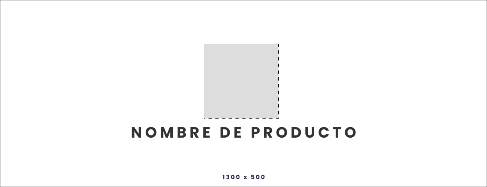

# **Web Develop Front-End Template**

<div align="center">
    
</div>

Bienvenido al repositorio oficial del proyecto **[Project](https://github.com/repository/Project)**, donde aquí se aloja el código fuente de la aplicación en calidad de frontend, construido con Vue JS y Javascript.

## **Guía de Instalación**

Para instalar este proyecto en calidad de desarrollo, siga los siguientes pasos:

1. Abra una ventana terminal.
   
2. Verifique si cuenta con Node JS instalado:
   
    ```sh
    node -v
    ```
    > **NOTA**: En caso de no contar con el entorno de ejecución de Javascript, Node JS, acceda al siguiente enlace para su instalación o actualización:
    > https://nodejs.org/es
    > 
    > Una vez instalado, ejecute el comando anterior para determinar si se realizo la instalación.
    >
    > De igual manera, si necesita gestionar múltiples versiones de Node JS, se recomienda utilizar la herramienta de **[NVM](https://medium.com/@diego.coder/instalar-nvm-node-version-manager-en-windows-80d6768fa183)** para una escalabilidad más robusta.

3. Realice una clonación del repositorio `Project`:
   
   ```sh
   git clone https://github.com/repository/Project
   ```

4. Situese en la raíz del proyecto:
   
    ```sh
    cd "Project"
    ```

5. Realice la instalación de módulos de Node JS:

    ```sh
    npm install
    ```

6. Para finalizar, abra el proyecto en su editor de código de preferencia. 🙌🏻

<br>

---
&copy; 2025 Cistem Innovacion S.A. de C.V. | Todos los derechos reservados.